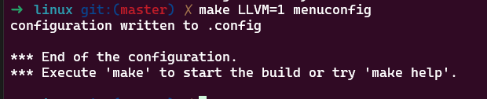
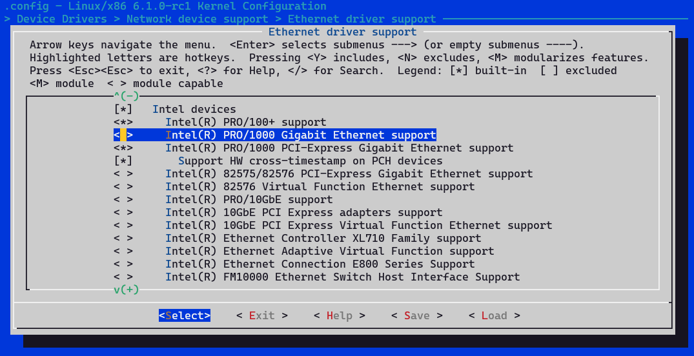
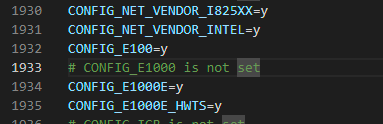
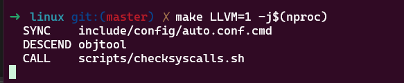
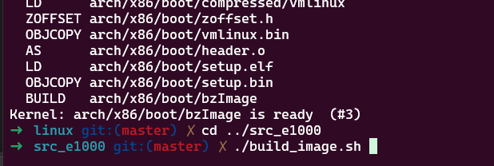
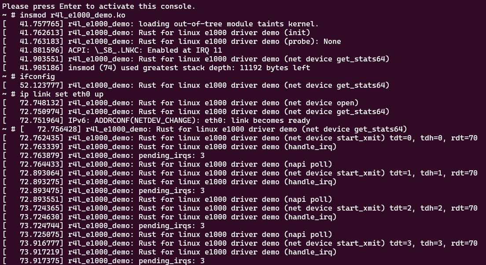
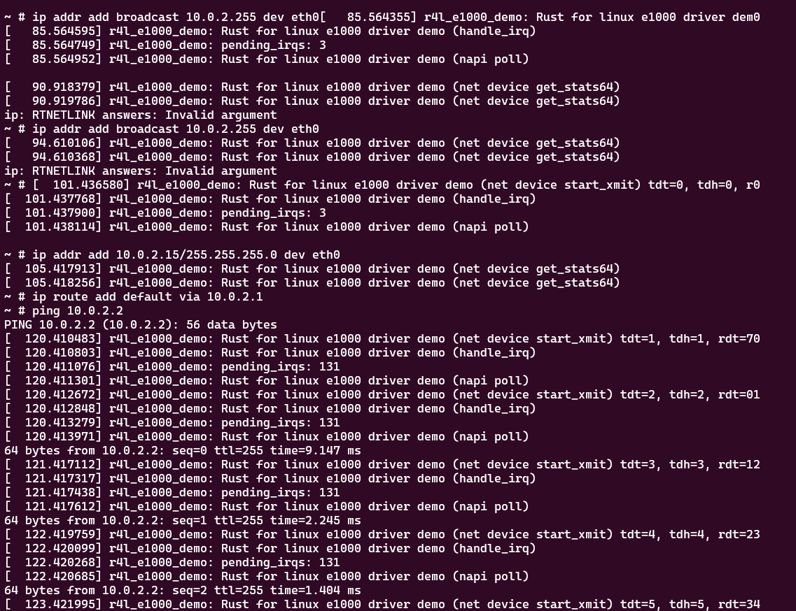

# 作业2：对Linux内核进行一些配置

## Q: 在该文件夹中调用make LLVM=1，该文件夹内的代码将编译成一个内核模块。请结合你学到的知识，回答以下两个问题：

### 1. 编译成内核模块，是在哪个文件中以哪条语句定义的？

.config文件中存储的tristate类型配置项,设置为y为内核模块

### 2. 该模块位于独立的文件夹内，却能编译成Linux内核模块，这叫做out-of-tree module，请分析它是如何与内核代码产生联系的？

通过调用 <linux/module.h>头文件中，module_init宏来定义模块入口函数，及module_exit宏来定义模块出口函数实现

