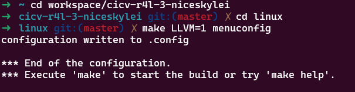
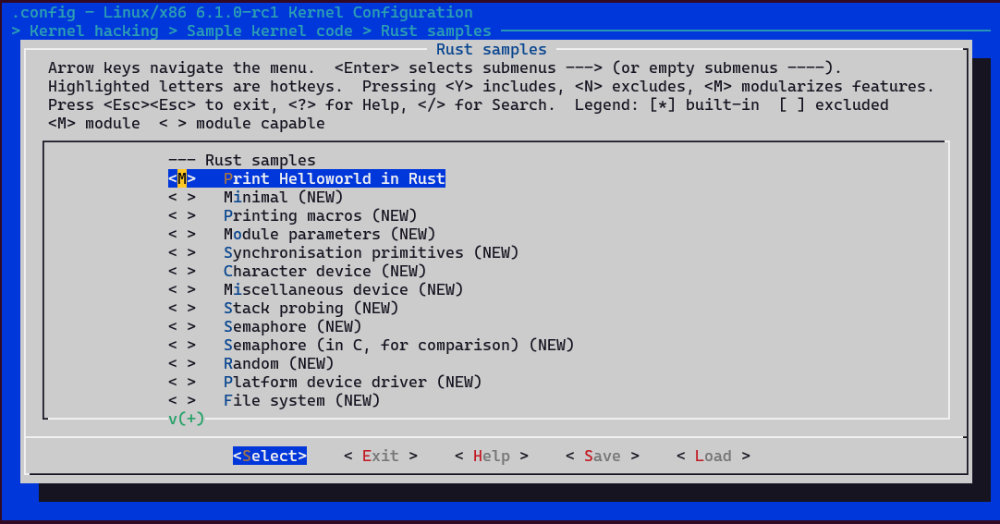
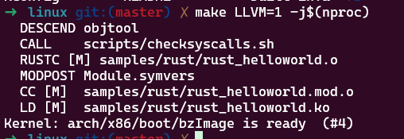
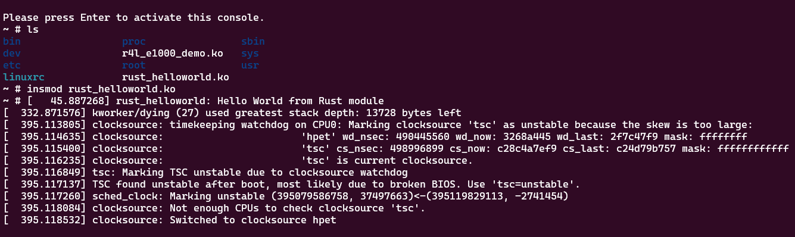

# 作业3：使用rust编写一个简单的内核模块并运行

## 修改samples/rust下的Makefile和Kconfig

```
diff --git a/linux/samples/rust/Kconfig b/linux/samples/rust/Kconfig
index 189c10ced..eb1f542e1 100644
--- a/linux/samples/rust/Kconfig
+++ b/linux/samples/rust/Kconfig
@@ -10,6 +10,16 @@ menuconfig SAMPLES_RUST
 
 if SAMPLES_RUST
 
+config SAMPLE_RUST_HELLOWORLD
+       tristate "Print Helloworld in Rust"
+       help
+         This option builds the Rust Helloworld module sample.
+
+         To compile this as a module, choose M here:
+         the module will be called rust_helloworld.
+
+         If unsure, say N.
+
 config SAMPLE_RUST_MINIMAL
        tristate "Minimal"
        help
```

```
diff --git a/linux/samples/rust/Makefile b/linux/samples/rust/Makefile
index 420bcefeb..82b0d1539 100644
--- a/linux/samples/rust/Makefile
+++ b/linux/samples/rust/Makefile
@@ -1,5 +1,6 @@
 # SPDX-License-Identifier: GPL-2.0
 
+obj-$(CONFIG_SAMPLE_RUST_HELLOWORLD)           += rust_helloworld.o
 obj-$(CONFIG_SAMPLE_RUST_MINIMAL)              += rust_minimal.o
 obj-$(CONFIG_SAMPLE_RUST_PRINT)                        += rust_print.o
 obj-$(CONFIG_SAMPLE_RUST_MODULE_PARAMETERS)    += rust_module_parameters.o
```

## 编译配置



## 配置设置



## 编译结果



### 运行结果


