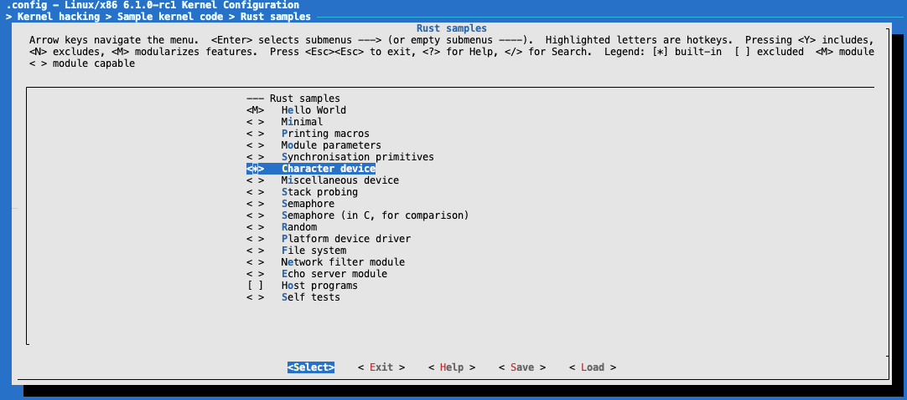
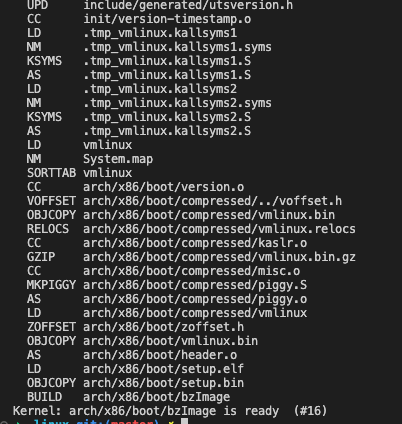
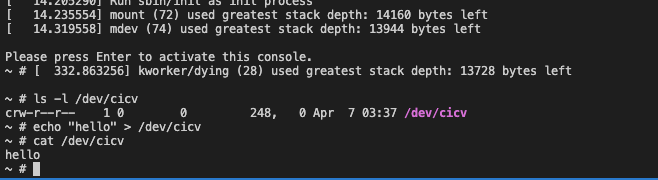

# 作业5：注册字符设备
## 步骤
### 配置

### 编译linux

### 在qemu-system-x86_64中运行

## 问答
* Q：作业5中的字符设备/dev/cicv是怎么创建的？它的设备号是多少？它是如何与我们写的字符设备驱动关联上的？
  
    在src_e1000下的build_image.sh文件中有这么一行，`echo "mknod /dev/cicv c 248 0" >> etc/init.d/rcS`,
/etc/init.d/rcS是一个启动脚本,使用mknod命令创建设备节点，用法如下：`mknod [-m MODE] NAME TYPE [MAJOR MINOR]`,因此/dev/cicv的主设备号是248，次设备号是0。

  在注册这个字符设备驱动时，使用了系统动态分配设备号的方式，即调用alloc_chrdev_region函数。系统会在字符设备号从254到234的范围内查找未分配的号码，而已被占用的范围是249到254。因此，该驱动被分配到的设备号是248，因此与/dev/cicv关联上。